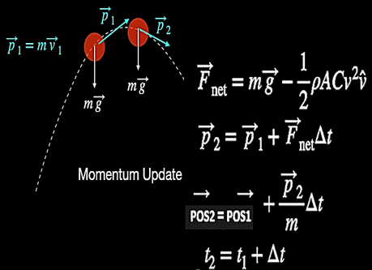
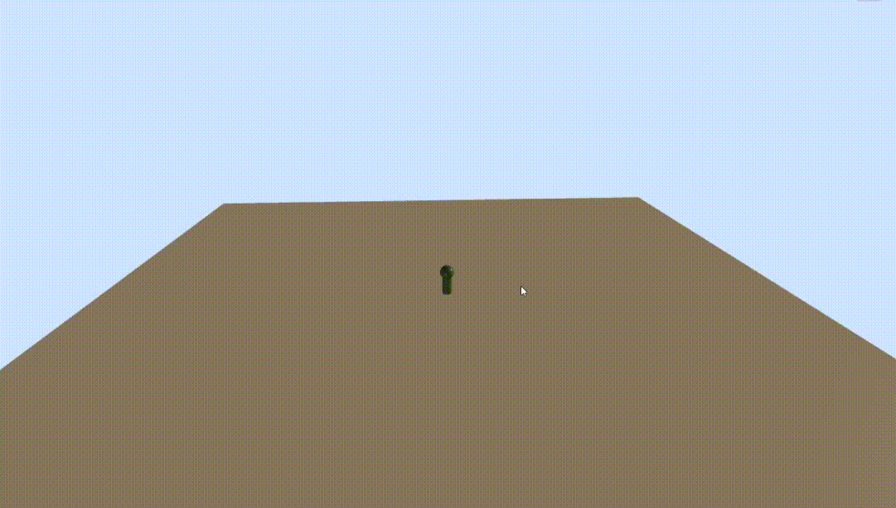

# My Awesome Project

A powerful tool for warriors who are frequently at risk on the battlefield from enemy threats.
##### for the full project process 👇👇
https://drive.google.com/file/d/1q0O257fhMMjlEKydk6M4gX1ZXdwJTvoX/view?usp=sharing

## Technological Protection for Combat Fighters
Technological Protection for Combat Fighters is an innovative project aimed at safeguarding soldiers on the battlefield. This technology enables fighters to engage in combat while remaining protected from shooting threats and grenade attacks, allowing them to fight effectively without the need to hide or retreat.

Our solution integrates advanced defense mechanisms, ensuring that soldiers can maintain their offensive capabilities while staying safe from harm. By leveraging this technology, we aim to enhance the security and efficiency of combat operations, offering a new level of protection for those on the front lines.

## Project Overview
This program receives real-time projectile threats from AMMS sensors and calculates the threat trajectory in less than a millisecond. It utilizes advanced physical and mathematical computations, considering air resistance and integrating weather data from radar to derive mechanical formulas. These formulas account for air density, pressure, temperature, humidity, altitude, wind directions, and more. The program also calculates the trajectory based on drag, shape, friction, speed, mass, diameter of the threat, and the 3D launch angle.

These calculations quickly produce an accurate interception point for threats to the soldier. The program intercepts if the trajectory poses or will pose a danger to the moving soldier until the threat is neutralized. It handles edge cases and only intercepts hostile fire towards the soldier, even considering friendly fire scenarios to intercept if necessary.

Some of the formulas of physical forces

 

This project is engineered to rapidly compute threat trajectories using C, based on real-time data input from AMMS sensors surrounding the soldier's environment. The system visualizes these threats in a 3D simulation, and when necessary, initiates interception to neutralize the danger.

Part of the project simulation👇

 
https://youtu.be/G6wFsjV6aeM
###  Project Summary
This project is a physical and mathematical project, designed to solve threats directed at the soldier. It quickly provides accurate intercept points, making it ideal for Warriors on the battlefield.

### License
This code is proprietary and confidential. You are granted permission to view this code but not to copy, use, distribute, or modify it without explicit permission from the owner.
